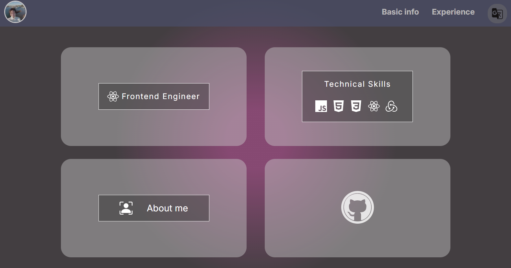

# This is a personal profile project

    -Frontend : A SSR and CSR hybrid project via Next.js
    -Backebd : Data and auth providor are using Firebase

## There are two main sections of this project

- [Main page (RWD ready)](https://liting-cv.vercel.app/en)Public to general users, read-only pages.

- [Admin page](https://liting-cv.vercel.app/en/admin)
  Allow authorized users to crud data through cloud-hosted database(firestore).
- Authentication processed via phone number(OTP through message).(Only available for Taiwanese mobile operators).
- Please note the pages are for demonstration, data accessibility is only on client side, any crud action is only available for privilege user.
  
## It's also color-scheme friendly 

### At light mode: 

### At dark mode: 

